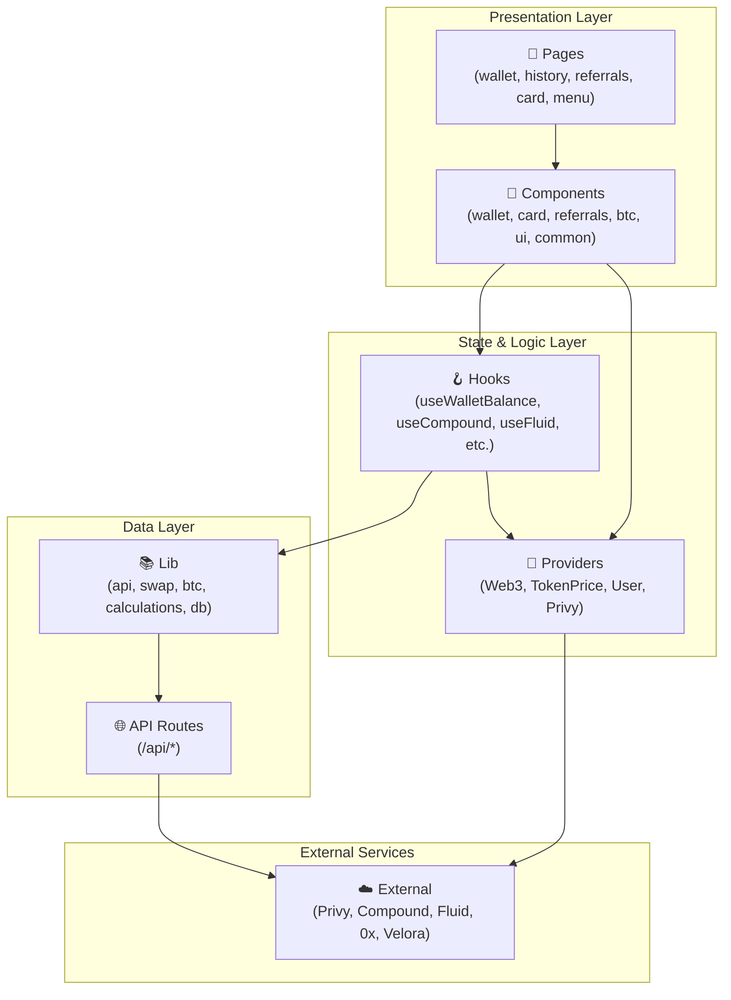

# Stackd-Web High-Level Component Dependency Diagram

This document provides a high-level overview of the component architecture and dependencies in the stackd-web project.

## Architecture Overview

```mermaid
graph TB
    subgraph "App Entry"
        RootLayout["layout.tsx<br/>(Root Layout)"]
    end

    subgraph "Provider Layer"
        Providers["providers.tsx"]
        QueryClient["QueryClientProvider<br/>(TanStack Query)"]
        Privy["PrivyProvider<br/>(Auth)"]
        TokenPrice["TokenPriceProvider"]
        Web3["Web3Provider<br/>(Wallet/Chain)"]
        User["UserProvider"]
        Tooltip["TooltipProvider"]
    end

    subgraph "Pages (App Router)"
        WalletPage["/wallet"]
        HistoryPage["/history"]
        ReferralsPage["/referrals"]
        MenuPage["/menu"]
        CardPage["/card"]
        WithdrawPage["/withdraw"]
        ProfilePage["/profile"]
    end

    subgraph "Wallet Components"
        Balance["Balance"]
        ActionButtons["ActionButtons"]
        ActiveLoans["ActiveLoans"]
        CollateralCard["CollateralCard"]
        LoanSimulator["LoanSimulator"]
        NewLoanModal["NewLoanModal"]
        WalletMenuButton["WalletMenuButton"]
    end

    subgraph "Card Components"
        VisaCard["VisaCard"]
        CardQuickActions["CardQuickActions"]
        CardBalance["CardBalance"]
        CardTransactionList["CardTransactionList"]
        AddToWalletButton["AddToWalletButton"]
    end

    subgraph "Referral Components"
        ReferralDashboard["ReferralDashboard"]
        LeaderboardModal["LeaderboardModal"]
        RewardsSimulatorModal["RewardsSimulatorModal"]
        TierComponents["TierCard/Progress/Explainer"]
    end

    subgraph "BTC Components"
        DepositFlow["DepositFlow"]
        WithdrawalFlow["WithdrawalFlow"]
        TransactionStatus["TransactionStatus"]
    end

    subgraph "UI Library"
        Card["Card"]
        Button["Button"]
        Modal["Modal"]
        Dialog["Dialog"]
        BottomNav["BottomNav"]
        ResponsiveNav["ResponsiveNav"]
        GlassCard["GlassCard"]
        Skeleton["Skeleton"]
    end

    subgraph "Common Components"
        InstallBanner["InstallBanner"]
        PageHeader["PageHeader"]
        PageTransition["PageTransition"]
        TokenIcon["TokenIcon"]
    end

    subgraph "Hooks Layer"
        useWalletBalance["useWalletBalance"]
        useCollateralBreakdown["useCollateralBreakdown"]
        useFluid["useFluid"]
        useCompound["useCompound"]
        useGaslessSwap["useGaslessSwap"]
        useTransactionHistory["useTransactionHistory"]
        useReferral["useReferral"]
        useBtcDeposit["useBtcDeposit"]
        useBtcWithdrawal["useBtcWithdrawal"]
    end

    subgraph "Lib Layer"
        API["lib/api/*"]
        Swap["lib/swap/*"]
        BTCLib["lib/btc/*"]
        DBLib["lib/db/*"]
        Calculations["lib/calculations/*"]
        Utils["lib/utils"]
    end

    subgraph "API Routes"
        TokenPricesAPI["/api/token-prices"]
        TransactionsAPI["/api/transactions"]
        ReferralsAPI["/api/referrals/*"]
        SwapAPI["/api/swap"]
        BTCAPI["/api/btc/*"]
    end

    %% Provider Hierarchy
    RootLayout --> Providers
    Providers --> QueryClient
    QueryClient --> Privy
    Privy --> Tooltip
    Tooltip --> TokenPrice
    TokenPrice --> Web3
    Web3 --> User

    %% Page Dependencies
    WalletPage --> Balance
    WalletPage --> ActionButtons
    WalletPage --> ActiveLoans
    WalletPage --> CollateralCard
    WalletPage --> NewLoanModal

    CardPage --> VisaCard
    CardPage --> CardQuickActions
    CardPage --> CardBalance
    CardPage --> CardTransactionList
    CardPage --> AddToWalletButton

    ReferralsPage --> ReferralDashboard
    ReferralDashboard --> LeaderboardModal
    ReferralDashboard --> RewardsSimulatorModal
    ReferralDashboard --> TierComponents

    %% Hook Dependencies
    Balance --> useWalletBalance
    CollateralCard --> useCollateralBreakdown
    LoanSimulator --> useCompound
    LoanSimulator --> useFluid
    ActiveLoans --> useCompound
    ActiveLoans --> useFluid

    DepositFlow --> useBtcDeposit
    WithdrawalFlow --> useBtcWithdrawal

    ReferralDashboard --> useReferral

    %% Lib Dependencies
    useWalletBalance --> API
    useCompound --> Calculations
    useFluid --> Calculations
    useGaslessSwap --> Swap

    useBtcDeposit --> BTCLib
    useBtcWithdrawal --> BTCLib

    %% API Route Dependencies
    TokenPrice --> TokenPricesAPI
    useTransactionHistory --> TransactionsAPI
    useReferral --> ReferralsAPI
    useGaslessSwap --> SwapAPI
    BTCLib --> BTCAPI
```



---

## Simplified Layer View



---

## Component Categories

### 📁 `/components/wallet/` - Core Wallet Features
| Component | Purpose | Key Dependencies |
|-----------|---------|------------------|
| `Balance` | Display total collateral value | `useWalletBalanceContext` |
| `ActionButtons` | Cash In, Deposit, Convert, Send | Navigation |
| `CollateralCard` | WBTC/XAUT collateral breakdown | `useCollateralBreakdown` |
| `LoanSimulator` | Borrow/Repay/Add Collateral flow | `useCompound`, `useFluid` |
| `ActiveLoans` | Show active loan positions | `useCompound`, `useFluid` |
| `NewLoanModal` | Create new loan modal | `LoanSimulator` |

### 📁 `/components/card/` - Virtual Card Features
| Component | Purpose | Key Dependencies |
|-----------|---------|------------------|
| `VisaCard` | Virtual card display | Card types |
| `CardQuickActions` | Lock, Details, PIN actions | - |
| `CardBalance` | Card balance display | - |
| `CardTransactionList` | Card transaction history | - |

### 📁 `/components/referrals/` - Rewards System
| Component | Purpose | Key Dependencies |
|-----------|---------|------------------|
| `ReferralDashboard` | Main referrals page | `useReferral` |
| `LeaderboardModal` | Referral leaderboard | `useLeaderboard` |
| `TierCard/Progress` | Tier display components | - |

### 📁 `/components/btc/` - Bitcoin Operations
| Component | Purpose | Key Dependencies |
|-----------|---------|------------------|
| `DepositFlow` | BTC → WBTC deposit | `useBtcDeposit` |
| `WithdrawalFlow` | WBTC → BTC withdrawal | `useBtcWithdrawal` |
| `TransactionStatus` | BTC tx status tracking | - |

### 📁 `/components/ui/` - Design System
| Component | Purpose |
|-----------|---------|
| `BottomNav` | Mobile bottom navigation |
| `ResponsiveNav` | Desktop top navigation |
| `Card`, `GlassCard` | Card containers |
| `Button`, `Modal`, `Dialog` | Interactive elements |
| `Skeleton` | Loading states |

---

## Provider Hierarchy

```
QueryClientProvider (TanStack Query)
└── PrivyProvider (Authentication)
    └── TooltipProvider
        └── TokenPriceProvider
            └── Web3Provider (Wallet, Chain Management)
                └── UserProvider (User State)
                    └── {children}
```

---

## Key Hooks

| Hook | Purpose | Data Source |
|------|---------|-------------|
| `useWalletBalance` | Wallet token balances | Arbitrum RPCs |
| `useCollateralBreakdown` | WBTC collateral details | Compound Protocol |
| `useCompound` | Compound V3 protocol interactions | Compound on Arbitrum |
| `useFluid` | Fluid protocol interactions | Fluid on Ethereum |
| `useGaslessSwap` | 0x/Velora gasless swaps | Swap APIs |
| `useTransactionHistory` | Wallet tx history | Arbiscan API |
| `useBtcDeposit/Withdrawal` | BTC bridge operations | BTC Bridge APIs |
| `useReferral` | Referral code & stats | `/api/referrals` |

---

## API Route Structure

```
/api
├── /0x              - 0x Swap integration
├── /btc             - BTC bridge endpoints
│   ├── /deposit
│   ├── /withdraw
│   ├── /status
│   └── /rates
├── /referrals       - Referral system
│   ├── /code
│   ├── /join
│   ├── /stats
│   └── /leaderboard
├── /swap            - Velora swap
├── /token-prices    - Token price feed
├── /transactions    - Tx history
└── /velora          - Velora integration
```

---

## External Service Dependencies

| Service | Purpose | Used By |
|---------|---------|---------|
| **Privy** | Authentication, Embedded Wallets | `Web3Provider` |
| **Compound V3** | WBTC Collateral, USDT Borrowing | `useCompound` |
| **Fluid** | XAUT Collateral, USDT Borrowing | `useFluid` |
| **0x API** | Token Swaps | `useGaslessSwap` |
| **Velora** | Gasless Swaps | `useVeloraSwap` |
| **Arbiscan** | Transaction History | `useTransactionHistory` |
| **CoinGecko** | Token Prices | `TokenPriceProvider` |

---

*Generated for stackd-web repository analysis*
